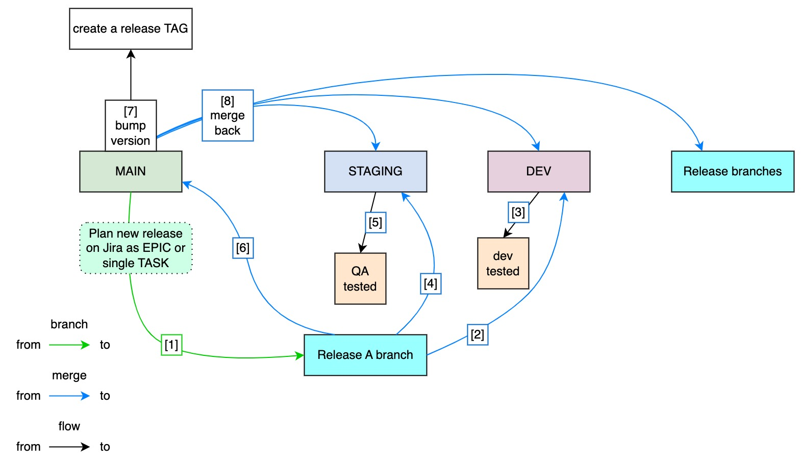
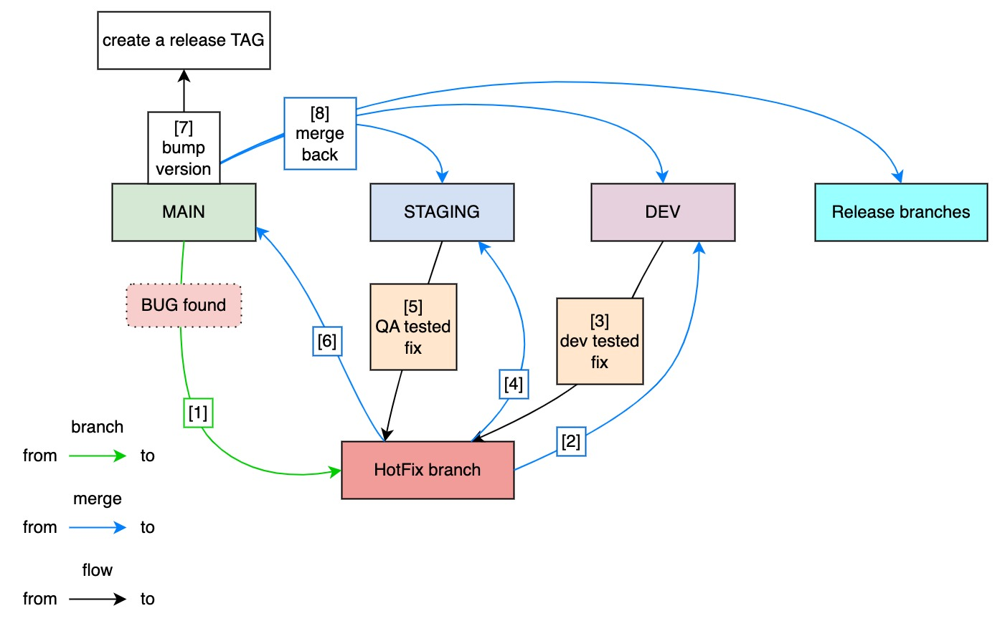

# GIT guidelines


## Base branches: Dev . Staging . Main
Base branches are codebase which are deployed to live environments. These branches should reject any commits or direct merge events.

Only a PullRequest from a Release or HotFix branch should be authorized to be merged to a base branch (exceptions can be made for the Dev branch).

- $\textcolor{mediumturquoise}{\text{Dev}}$ : represents the $\textcolor{pink}{\text{development branch}}$ where developers can push their code and features freely. This branch should have its own live environment to help developers with their own test procedures.
- $\textcolor{mediumturquoise}{\text{Staging}}$ : host Release branches that $\textcolor{pink}{\text{need to be tested by QA}}$. Once a developer is confident with his work within a Release branch, he should create a PR to Staging. He then needs to plan a testing session with QA . Once QA is ready to test, the PR can be merged.
- $\textcolor{mediumturquoise}{\text{Main}}$: host the $\textcolor{pink}{\text{latest stable code}}$. After QA fully tested and approved a Release branch, it is then merged to Main. The developer then creates a TAG release. The Main branch can be the source of a pre-release environment to test again before deploying the Tag to production.

## Release branches
A Release branch represents a planned release and can be composed of different features and work that needs to be released at a given time. It can be associated as an Epic on Jira for example. It is advised to isolate the business scope within different Release in order to minimise the risk of conflicts with other simultaneous releases.

It should be composed of the Task manager Epic/MainTask number and a name.

The name should be explicit and short. Avoid using verbs, because it is redundant for a branch name. $\textcolor{pink}{\text{The goal here is to specify the scope, not the task.}}$

**Naming:** 
- $\textcolor{slateblue}{\text{jira-main-number}}$/ $\textcolor{teal}{\text{branch-name}}$
- Use '_' to separate words
- Only specify the scope, avoid using verbs such as add / update / delete ...
- Keep it really short and concise
  - Example: DX-50/web3_login

**Rules:**
- Only create Release branch from Main
- Release branch merge flow :
  - to 'dev' for developer own tests
  - to 'staging' for QA
  - to 'main' to create a release Tag
- Only one release branch per task_main_number
- Multiple Release branches can live at same time on Staging and Dev
- Avoid shared scope between different Release branches . If you are working on the same part of the codebase for 2 different releases, it probably means that either you should only have one release or that one of the releases is scheduled way in the future which is ok(means that you will be able to merge Main back to your late second Release branch later on)
- Use Merge or PullRequest to merge to Dev and PullRequest to merge to Staging and Main
- $\textcolor{tomato}{\text{DO NOT MERGE STAGING TO MAIN}}$, only merge individual release branch to main once tested in staging
- After each Release to production, merge Main back to each of your branches (Dev, Staging, all other Release branches...)
- DO NOT MERGE Dev, Staging or other Release branch to your own Release branch. Only merge Main or SubRelease branch(children) with your Release branch



### SubRelease branches
A SubRelease branch can be created to represent a task or subtask within a release .
It is considered as a child of a Release branch and needs to respect the same format as its parent.
You can use SubRelease branch when multiple developers are working on the same release. Otherwise, it is better to stay on one branch and use proper commits format to reference tasks & subtasks. $\textcolor{pink}{\text{Value good commits structure over sub branches whenever possible.}}$

**Naming:**
- $\textcolor{slateblue}{\text{jira-main-number}}$/ $\textcolor{lightblue}{\text{jira-sub-number}}$ _ $\textcolor{teal}{\text{branch-name}}$
- Use '_' to separate words
- Keep it explicit and relatively short
  - Example: DX-50/DX-51_wallet_login
  - Example: DX-50/DX-52_email_login

**Rules:**
- Only create SubRelease branch from parent Release branch
- Consider your parent Release branch as your only provider and destination (merge from and to)
- Release branch merge flow :
  - Only merge into parent Release branch either with Merge or PullRequest based on your rights
  - Merging to any other branch is forbidden
  - Refer to Release branch git flow for parent flow
- Multiple SubRelease branches can be created under the same jira_sub_number, in order to represent each sub task if needed (it's better to simply use commits rules under the same SubRelease branch though)

## HotFix branches
When a bug is found in production and needs immediate fix, a HotFix branch can be created to bypass the Release branches restrictions.
**Naming:** 
- $\textcolor{red}{\text{hotfix}}$/ $\textcolor{slateblue}{\text{jira-main-number}}$ _ $\textcolor{teal}{\text{hotfix-branch-name}}$
- Use '_' to separate words
- Keep it explicit and relatively short
  - Example: hotfix/DX-50_login_api_fail

**Rules:**
- Only create HotFix branch from Main
- Release branch merge flow :
  - to 'dev' for developer own tests
  - to 'staging' for QA
  - to 'main' to publish the hotfix individually
- $\textcolor{tomato}{\text{DO NOT MERGE STAGING TO MAIN}}$, only merge individual HotFix branches into Main once tested in staging
- Only one hotfix branch per jira_main_number
- Do not create sub branches for Hotfix branches



**Commit:**

Hotfix commits should follow commits rules but only the keyword 'hotfix' is authorized.
```
hotfix: {message} #{jira_number}
```

## Commits
Commits are used to save work progress under a Release branch or SubRelease branch. It is advised to commit your progress regularly (at least one per day) with a relevant name which describes your changes. If possible, split your work into different commits to explicitly show your progress and facilitate commit reverse. $\textcolor{pink}{\text{One commit per completed step should be your goal.}}$

Commits messages will be composed of an action keyword, an explanation message and need to contain the Jira task or subtask to which it belongs.

The required format will be as follows : 
```
{action_keywork}: {message} #{jira_number}
```

**Commit Keyword**:
  - **$\textcolor{green}{\text{task}}$** : a development task which represents a code update to improve the product. It includes add/update/delete of code as features
  - $\textcolor{orange}{\text{fix}}$ : represent the correction of a bug. Use it either to fix a previous task keyword during development or during the QA phase.
  - $\textcolor{red}{\text{hotfix}}$ : represent the correction of a bug from Main branch, it should only be used for commits within a HotFix branch
  - $\textcolor{red}{\text{break}}$: use this keyword to highlight a breaking change, such as removing an API endpoint. You have to mention in the message, after a line breaks every feature that is now deleted/deprecated.
  - $\textcolor{magenta}{\text{clean}}$ : represent the deletion of non-relevant or unused codebase, the rename or restructuration of code. Overall, it should not have any impact on the inner logic and does not require testing.
  - $\textcolor{lightblue}{\text{doc}}$ : include readme file, codebase (function & class docs ...) documentation or any other kind of documentation related to your project
  - $\textcolor{grey}{\text{extra}}$ : any changes which are not related to your codebase (so it doesn't affect the code or its dependencies) and that are not documentations but are still part of your repository. For example, if you maintain an external SDK as package.
  

## PullRequest

**Naming:**
- The title should include the target branch nickname and the current branch
- The description should be composed of:
  -  a short detailed message
  -  a summary of all the main changes made within your branch. Each change should be composed of an action keyword and a message : {keyword}: {message}
     - add : some new api / features etc..
     - break : deleted some used features
     - update : if some logic has been updated
  - If the Feature branch has a parent Jira task (an Epic for example), you should add it at the end
- Keep it concise
  - Example :
```
TITLE: [DEV] DX-50/web3_login
 
DESCRIPTION:
 Implement login APIs and set new password rules
 
 add: /auth/login
 add: /auth/metamask/login
 update: password rules

 Parent: DX-10
```

## Merge PullRequest Commit
**Naming:**
- The title should include the target branch nickname and the current branch
- The description should be composed of:
  -  copy & paste of the PullRequest body
- Example :
```
TITLE: (DEV) merge (DX-50/login_flow)
 
DESCRIPTION:
 Implement login APIs and set new password rules
 
 add: /auth/login
 add: /auth/metamask/login
 update: password rules
```


## Appendix
- $\textcolor{slateblue}{\text{jira-main-number}}$ represents the parent feature, such as an epic on Jira
- $\textcolor{lightblue}{\text{jira-sub-number}}$ represents the child of a feature or a task within a feature
